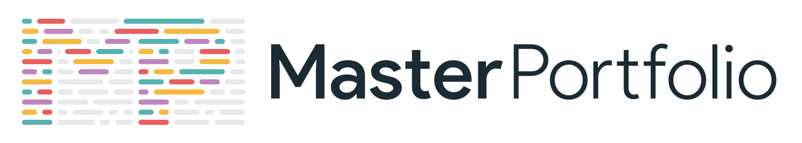
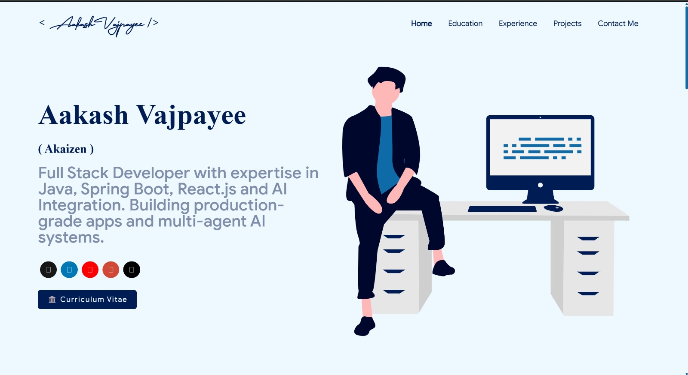

<p align="center"> 
    </img>
</p>

<h1 align="center"> Aakash Vajpayee — Developer Portfolio 🔥 </h1> 
<h3 align="center"> A clean, beautiful, responsive, and 100% customizable portfolio <br /> built for Full Stack Developers & AI Enthusiasts! </h3>

<p align="center">
  <a href="https://nodejs.org/en/blog/release/v20.11.1"></a>
  <a href="https://www.npmjs.com/package/npm/v/10.2.4"></a>
  <a href="https://reactjs.org/"></a>
  <a href="https://github.com/prettier/prettier"></a>
  <a href="http://badges.mit-license.org/"></a>
  <a href="https://github.com/Aakash-vajpayee/masterPortfolio/commits/master"></a>
  <a href="https://img.shields.io/badge/price-free-ff69b4"></a>
</p>

<p align="center"> 
  <a href="https://master-portfolio-aakash.vercel.app" target="_blank">
   
  </a>
</p>

:star: Star this repo on GitHub — it motivates me to build more!

---

# 👨‍💻 About Me

Hey! I'm **Aakash Vajpayee** (_Akaizen_) — a passionate **Full Stack Developer** from **Delhi, India**.

- 🎓 Pursuing **BCA at CSJM University, Kanpur**
- 🔭 Currently building: **Production-grade Web Apps & AI Systems**
- 🌱 Learning: **Advanced Full Stack — Java, Spring Boot, React.js, Node.js**
- 🤖 Passionate about: **AI Integration & Multi-Agent Systems**
- 📫 Contact me: **akashbajpai167@gmail.com**
- ⚡ Fun fact: _I transitioned from deep backend work to Full Stack and reduced backend response times through architecture optimization!_

---

# Sections 📚

✔️ Summary and About Me\
✔️ Skills\
✔️ Open Source Projects Connected with GitHub\
✔️ Experience\
✔️ Education\
✔️ Contact Me\
✔️ Resume Viewer

To view the live portfolio → **[Click here](my-portfolio-ten-psi-xztqvy6vfy.vercel.app)**

---

# Table of Contents

- [Clone and Use](#clone-and-use)
- [Customizing](#customize-it-to-make-your-own-portfolio)
- [Choose Theme](#choose-theme)
- [Add Resume](#resume)
- [Deployment](#deployment)
- [Technologies Used](#technologies-used)
- [License](#license)

---

# Clone and Use 📋

- This portfolio is built on `react-js` — you need `nodejs` and `npm` installed
- Clone the repository:
  ```bash
  git clone https://github.com/Aakash-vajpayee/masterPortfolio.git
  ```
- Navigate into the folder and install dependencies:
  ```bash
  npm install
  ```
- Run locally:
  ```bash
  npm start
  ```
  This will open the portfolio on `localhost:3000`

---

# Customize it to make your own portfolio ✏️

There are **4 main things** to customize: `package.json`, **Personal Information**, **Github Information**, and **Splash Logo**.

### package.json

Open this file in the main directory, set your `"name"` and change `"homepage"` to:

```
https://Aakash-vajpayee.github.io
```

### Personal Information

Edit `src/portfolio.js` — this controls everything on the website:

```javascript
// Home Page
const greeting = { ... }

// Social Media
const socialMediaLinks = { ... }

// Skills, Experience, Education, Contact etc.
```

### How to change Skill Icons?

1. Visit: https://icon-sets.iconify.design/
2. Search for the skill (e.g., "java", "spring", "react")
3. Copy the **Selected Icon** text
4. Replace it with `fontAwesomeClassName` in `portfolio.js`

### How to use Custom Images for Skills?

1. Add image to `public/skills/` folder
2. Use `imageSrc: "yourImage.png"` in the skill object
3. Remove or leave `fontAwesomeClassName` empty

### GitHub Information

Copy `env.example` → create `.env` file → fill in:

```
GITHUB_TOKEN = your_personal_access_token
GITHUB_USERNAME = Aakash-vajpayee
```

Then run:

```bash
node git_data_fetcher.mjs
```

This fetches your GitHub data — pull requests, issues, pinned projects, organizations — automatically!

> ⚠️ **Never share your GitHub token publicly!**

### Splash Logo

The animated **AV logo** on the splash screen is built using SVG + CSS animation inside `./src/components/Loader`.

- To **disable splash screen**, open `src/portfolio.js` and set:
  ```javascript
  const settings = {
    isSplash: false,
  };
  ```
- To **re-enable** after editing your logo, set `isSplash: true`

---

# Choose Theme 🌈

- Open `src/theme.js` to see all available themes
- At the bottom change:
  ```javascript
  export const chosenTheme = blueTheme; // change blueTheme to any theme
  ```
- You can also define your own custom theme in the same file
- Run `npm start` to preview your changes

---

# Resume 📃

1. Place your resume PDF in `/src/assets/docs/`
2. Open `/src/pages/resume/Resume.js`
3. Update the import:
   ```javascript
   import myResumePdf from "../../assets/docs/YOUR_RESUME_NAME.pdf";
   ```
4. Visit `localhost:3000/resume` to preview it

> 📌 Keep your resume in **A4 size** for best display.

---

# Deployment 📦

### Option 1 — Vercel (Recommended ✅)

1. Push your code to GitHub
2. Go to [vercel.com](https://vercel.com) → Sign in with GitHub
3. Import `masterPortfolio` repo
4. Set:
   - Framework: `Create React App`
   - Build Command: `npm run build`
   - Output Directory: `build`
5. Click **Deploy** — done in 2 minutes!

Every future `git push` will auto-deploy your latest changes. 🚀

### Option 2 — GitHub Pages

1. In `package.json`, set:
   ```json
   "homepage": "https://Aakash-vajpayee.github.io"
   ```
2. Run:
   ```bash
   npm run build
   npm run deploy
   ```
3. Go to repo **Settings → Pages → Source: gh-pages branch**

Your site will be live at `https://Aakash-vajpayee.github.io` ✅

---

# Technologies Used 🛠️

- [React.js](https://reactjs.org/)
- [JavaScript (ES6+)](https://developer.mozilla.org/en-US/docs/Web/JavaScript)
- [Java & Spring Boot](https://spring.io/projects/spring-boot)
- [Python & LangChain](https://www.langchain.com/)
- [Node.js & Express.js](https://expressjs.com/)
- [GraphQL](https://graphql.org/)
- [styled-components](https://styled-components.com/)
- [react-reveal](https://www.react-reveal.com/)

---

# Illustrations 🍥

- [UnDraw](https://undraw.co/illustrations)

---

# 📊 My GitHub Stats


---

# 🤝 Connect With Me

[](https://linkedin.com/in/aakash-vajpayee)
[](mailto:akashbajpai167@gmail.com)
[](https://github.com/Aakash-vajpayee)

---

# License 📄

This project is licensed under the MIT License - see the [LICENSE.md](./LICENSE) file for details.

# Contributors ✨

<!-- ALL-CONTRIBUTORS-LIST:START - Do not remove or modify this section -->
<!-- prettier-ignore-start -->
<!-- markdownlint-disable -->
<!-- <table>
  <tbody>
    <tr>
      <td align="center" valign="top" width="14.28%"><a href="http://ashutosh1919.github.io"><br /><sub><b>Aakash Vajpayee</b></sub></a><br /><a href="https://github.com/ashutosh1919/masterPortfolio/commits?author=ashutosh1919" title="Code">💻</a> <a href="https://github.com/ashutosh1919/masterPortfolio/commits?author=ashutosh1919" title="Documentation">📖</a> <a href="#design-ashutosh1919" title="Design">🎨</a> <a href="#maintenance-ashutosh1919" title="Maintenance">🚧</a> <a href="#ideas-ashutosh1919" title="Ideas, Planning, & Feedback">🤔</a></td>
      <td align="center" valign="top" width="14.28%"><a href="https://danielmarostica.github.io/"><br /><sub><b>Daniel Marostica</b></sub></a><br /><a href="https://github.com/ashutosh1919/masterPortfolio/commits?author=danielmarostica" title="Documentation">📖</a> <a href="#design-danielmarostica" title="Design">🎨</a></td>
      <td align="center" valign="top" width="14.28%"><a href="https://dineshnadimpalli.com"><br /><sub><b>Dinesh Nadimpalli</b></sub></a><br /><a href="https://github.com/ashutosh1919/masterPortfolio/commits?author=dineshnadimpalli" title="Code">💻</a></td>
      <td align="center" valign="top" width="14.28%"><a href="http://jivthesh.github.io"><br /><sub><b>Jivthesh M R</b></sub></a><br /><a href="https://github.com/ashutosh1919/masterPortfolio/commits?author=jivthesh" title="Documentation">📖</a></td>
      <td align="center" valign="top" width="14.28%"><a href="http://jatinchauhan.tech"><br /><sub><b>Jatin Chauhan</b></sub></a><br /><a href="https://github.com/ashutosh1919/masterPortfolio/commits?author=mrjatinchauhan" title="Code">💻</a></td>
      <td align="center" valign="top" width="14.28%"><a href="https://th3c0d3br34ker.github.io/"><br /><sub><b>Jainam Desai</b></sub></a><br /><a href="https://github.com/ashutosh1919/masterPortfolio/commits?author=th3c0d3br34ker" title="Code">💻</a> <a href="#question-th3c0d3br34ker" title="Answering Questions">💬</a></td>
      <td align="center" valign="top" width="14.28%"><a href="https://miftaulmannan.wordpress.com/"><br /><sub><b>Miftaul Mannan</b></sub></a><br /><a href="https://github.com/ashutosh1919/masterPortfolio/commits?author=Tasin5541" title="Code">💻</a></td>
    </tr>
    <tr>
      <td align="center" valign="top" width="14.28%"><a href="http://a-mishra.github.io"><br /><sub><b>Ashutosh Mishra</b></sub></a><br /><a href="https://github.com/ashutosh1919/masterPortfolio/commits?author=a-mishra" title="Code">💻</a></td>
      <td align="center" valign="top" width="14.28%"><a href="http://tamojit.wixsite.com/mrtamojit"><br /><sub><b>Tamojit</b></sub></a><br /><a href="https://github.com/ashutosh1919/masterPortfolio/commits?author=tamojit-123" title="Documentation">📖</a> <a href="https://github.com/ashutosh1919/masterPortfolio/commits?author=tamojit-123" title="Code">💻</a> <a href="#design-tamojit-123" title="Design">🎨</a></td>
      <td align="center" valign="top" width="14.28%"><a href="https://prabin-karki.com.np"><br /><sub><b>Prabin Karki</b></sub></a><br /><a href="https://github.com/ashutosh1919/masterPortfolio/commits?author=githubprabin143" title="Code">💻</a></td>
      <td align="center" valign="top" width="14.28%"><a href="https://praveen.science/"><br /><sub><b>Praveen Kumar Purushothaman</b></sub></a><br /><a href="https://github.com/ashutosh1919/masterPortfolio/commits?author=praveenscience" title="Documentation">📖</a></td>
      <td align="center" valign="top" width="14.28%"><a href="http://baul.ml"><br /><sub><b>paul</b></sub></a><br /><a href="https://github.com/ashutosh1919/masterPortfolio/commits?author=baulml" title="Code">💻</a></td>
      <td align="center" valign="top" width="14.28%"><a href="https://github.com/SandipDhang"><br /><sub><b>Sandip Dhang</b></sub></a><br /><a href="https://github.com/ashutosh1919/masterPortfolio/commits?author=SandipDhang" title="Code">💻</a></td>
      <td align="center" valign="top" width="14.28%"><a href="https://github.com/ioribrn"><br /><sub><b>Jawad Moustadif</b></sub></a><br /><a href="https://github.com/ashutosh1919/masterPortfolio/commits?author=ioribrn" title="Code">💻</a></td>
    </tr>
    <tr>
      <td align="center" valign="top" width="14.28%"><a href="https://github.com/priyanshk20"><br /><sub><b>Priyansh Khandelwal</b></sub></a><br /><a href="https://github.com/ashutosh1919/masterPortfolio/commits?author=priyanshk20" title="Code">💻</a> <a href="#design-priyanshk20" title="Design">🎨</a></td>
      <td align="center" valign="top" width="14.28%"><a href="https://github.com/abdslam01"><br /><sub><b>Abdessalam Bahafid</b></sub></a><br /><a href="https://github.com/ashutosh1919/masterPortfolio/commits?author=abdslam01" title="Code">💻</a></td>
      <td align="center" valign="top" width="14.28%"><a href="https://dhruvkrishnavaid.github.io"><br /><sub><b>Dhruv Krishna Vaid</b></sub></a><br /><a href="https://github.com/ashutosh1919/masterPortfolio/commits?author=dhruvkrishnavaid" title="Code">💻</a> <a href="https://github.com/ashutosh1919/masterPortfolio/commits?author=dhruvkrishnavaid" title="Documentation">📖</a> <a href="#ideas-dhruvkrishnavaid" title="Ideas, Planning, & Feedback">🤔</a> <a href="#question-dhruvkrishnavaid" title="Answering Questions">💬</a></td>
      <td align="center" valign="top" width="14.28%"><a href="https://kasroudra.github.io"><br /><sub><b>KasRoudra</b></sub></a><br /><a href="https://github.com/ashutosh1919/masterPortfolio/commits?author=KasRoudra" title="Code">💻</a></td>
      <td align="center" valign="top" width="14.28%"><a href="https://telegram.dog/AlbertEinstein_TG"><br /><sub><b>Albert Einstein</b></sub></a><br /><a href="https://github.com/ashutosh1919/masterPortfolio/commits?author=AlbertEinsteinTG" title="Documentation">📖</a></td>
      <td align="center" valign="top" width="14.28%"><a href="https://github.com/SurajPratap10"><br /><sub><b>Suraj Pratap</b></sub></a><br /><a href="https://github.com/ashutosh1919/masterPortfolio/commits?author=SurajPratap10" title="Documentation">📖</a></td>
      <td align="center" valign="top" width="14.28%"><a href="https://lightmap.dev"><br /><sub><b>Sai Teja</b></sub></a><br /><a href="https://github.com/ashutosh1919/masterPortfolio/commits?author=saiteja13427" title="Code">💻</a> <a href="https://github.com/ashutosh1919/masterPortfolio/commits?author=saiteja13427" title="Documentation">📖</a> <a href="#maintenance-saiteja13427" title="Maintenance">🚧</a> <a href="#ideas-saiteja13427" title="Ideas, Planning, & Feedback">🤔</a></td>
    </tr>
    <tr>
      <td align="center" valign="top" width="14.28%"><a href="https://anirudhpanda.in/"><br /><sub><b>Anirudh Panda</b></sub></a><br /><a href="https://github.com/ashutosh1919/masterPortfolio/commits?author=AnirudhPanda" title="Code">💻</a></td>
      <td align="center" valign="top" width="14.28%"><a href="https://hidayat7z.github.io"><br /><sub><b>Md Hidayat Rasool</b></sub></a><br /><a href="https://github.com/ashutosh1919/masterPortfolio/commits?author=hidayat7z" title="Documentation">📖</a></td>
      <td align="center" valign="top" width="14.28%"><a href="https://www.linkedin.com/in/siddhantsadangi/"><br /><sub><b>Siddhant Sadangi</b></sub></a><br /><a href="https://github.com/ashutosh1919/masterPortfolio/commits?author=SiddhantSadangi" title="Documentation">📖</a></td>
      <td align="center" valign="top" width="14.28%"><a href="https://anoopvarghese.in/"><br /><sub><b>Anoop V</b></sub></a><br /><a href="https://github.com/ashutosh1919/masterPortfolio/commits?author=vanoop729" title="Code">💻</a></td>
      <td align="center" valign="top" width="14.28%"><a href="https://github.com/aash1999"><br /><sub><b>Aakash Singh</b></sub></a><br /><a href="https://github.com/ashutosh1919/masterPortfolio/commits?author=aash1999" title="Code">💻</a></td>
      <td align="center" valign="top" width="14.28%"><a href="https://aherrera3.github.io/"><br /><sub><b>Angélica Herrera Alba</b></sub></a><br /><a href="https://github.com/ashutosh1919/masterPortfolio/commits?author=aherrera3" title="Code">💻</a></td>
      <td align="center" valign="top" width="14.28%"><a href="https://davidminkovski.com"><br /><sub><b>David Minkovski</b></sub></a><br /><a href="#ideas-dminkovski" title="Ideas, Planning, & Feedback">🤔</a> <a href="https://github.com/ashutosh1919/masterPortfolio/commits?author=dminkovski" title="Code">💻</a></td>
    </tr>
    <tr>
      <td align="center" valign="top" width="14.28%"><a href="http://cdigruttola.it"><br /><sub><b>Carmine Di Gruttola</b></sub></a><br /><a href="#ideas-cdigruttola" title="Ideas, Planning, & Feedback">🤔</a> <a href="#promotion-cdigruttola" title="Promotion">📣</a></td>
      <td align="center" valign="top" width="14.28%"><a href="https://github.com/Vyomrana02"><br /><sub><b>Vyom Rana</b></sub></a><br /><a href="https://github.com/ashutosh1919/masterPortfolio/commits?author=Vyomrana02" title="Code">💻</a></td>
      <td align="center" valign="top" width="14.28%"><a href="https://github.com/parthrc"><br /><sub><b>Parth Chawande</b></sub></a><br /><a href="https://github.com/ashutosh1919/masterPortfolio/commits?author=parthrc" title="Code">💻</a></td>
      <td align="center" valign="top" width="14.28%"><a href="https://github.com/0Armaan025"><br /><sub><b>Armaan</b></sub></a><br /><a href="https://github.com/ashutosh1919/masterPortfolio/commits?author=0Armaan025" title="Documentation">📖</a></td>
      <td align="center" valign="top" width="14.28%"><a href="https://varundhand.netlify.app/"><br /><sub><b>Varun Dhand</b></sub></a><br /><a href="https://github.com/ashutosh1919/masterPortfolio/commits?author=varundhand" title="Code">💻</a></td>
      <td align="center" valign="top" width="14.28%"><a href="http://vjspranav.dev"><br /><sub><b>VJS Pranavasri</b></sub></a><br /><a href="https://github.com/ashutosh1919/masterPortfolio/commits?author=vjspranav" title="Code">💻</a></td>
      <td align="center" valign="top" width="14.28%"><a href="https://rahulkush1.github.io/"><br /><sub><b>Rahul Kushwaha</b></sub></a><br /><a href="https://github.com/ashutosh1919/masterPortfolio/commits?author=Rahulkush1" title="Code">💻</a></td>
    </tr>
    <tr>
      <td align="center" valign="top" width="14.28%"><a href="https://github.com/Adamou02"><br /><sub><b>Adam Bouhrara</b></sub></a><br /><a href="https://github.com/ashutosh1919/masterPortfolio/commits?author=Adamou02" title="Code">💻</a></td>
      <td align="center" valign="top" width="14.28%"><a href="https://github.com/16ratneshkumar"><br /><sub><b>Ratnesh Kumar</b></sub></a><br /><a href="https://github.com/ashutosh1919/masterPortfolio/commits?author=16ratneshkumar" title="Code">💻</a> <a href="https://github.com/ashutosh1919/masterPortfolio/commits?author=16ratneshkumar" title="Documentation">📖</a></td>
      <td align="center" valign="top" width="14.28%"><a href="https://github.com/Towbee05"><br /><sub><b>Tobi</b></sub></a><br /><a href="https://github.com/ashutosh1919/masterPortfolio/commits?author=Towbee05" title="Documentation">📖</a></td>
      <td align="center" valign="top" width="14.28%"><a href="https://sakshamjoshi.vercel.app/"><br /><sub><b>SAKSHAM JOSHI</b></sub></a><br /><a href="#design-saksham-joshi" title="Design">🎨</a> <a href="https://github.com/ashutosh1919/masterPortfolio/commits?author=saksham-joshi" title="Code">💻</a> <a href="https://github.com/ashutosh1919/masterPortfolio/commits?author=saksham-joshi" title="Documentation">📖</a></td>
    </tr>
  </tbody>
</table> -->

<!-- markdownlint-restore -->
<!-- prettier-ignore-end -->

<!-- ALL-CONTRIBUTORS-LIST:END -->

# References 👏🏻

- Some Design and Implementation Ideas are taken from [Saad Pasta's Portfolio Project](https://github.com/saadpasta/developerFolio).
- The Logo of MasterPortfolio is inspired from [prettier-logo](https://github.com/prettier/prettier-logo) for [prettier](https://github.com/prettier/prettier) designed by @ianstormtaylor.
